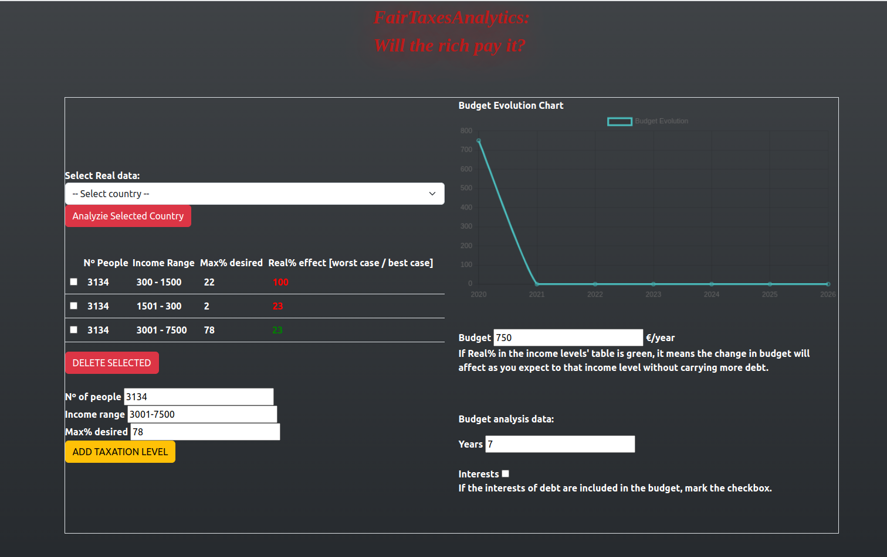

# What is this Repo for? 🤔

This repository was a playground for me during my initial phase of learning front-end development with React. I used it to explore the use of APIs from the front-end, discovering how to connect and interact with various services.

Eventually, I mastered these concepts and more, concurrently developing another, more significant project in my portfolio: [BuddyFightersNft](https://github.com/CarlosAlegreUr/BuddyFighters-FullstackWeb3NFTGame). This experience laid the foundation for crafting a complex (state-wise) Single Page Application (SPA) using React.

<hr/>

# FTA (Fair-Taxes-Analytics) 💰

## (IN DEVELOPMENT)

FTA is a SPA created using React. It's designed to provide users with a tool to analyze the percentage of government spending and how it translates to costs for individuals across various taxation levels.

By including API calls to fetch official government data, it ensures an accurate and reliable analysis, offering insights into the financial implications of different fiscal policies.

## How to Use ❓

If you're curious to explore the website, you can clone the repository and start it locally by following these steps:

```
git clone https://github.com/CarlosAlegreUr/FairTaxesAnalytics-WebDevReactJs.git
// navigate to the directory and execute
npm start
```

Here is an screenshot displating a part of the website:



> 🐣 **Note** 🐣: Looking back, this project stands as a charming testament to my early development days. Its simplicity and innocence reflect the growth and learning that awaited me. Who knows, maybe one day I come back and finish it. 😄
